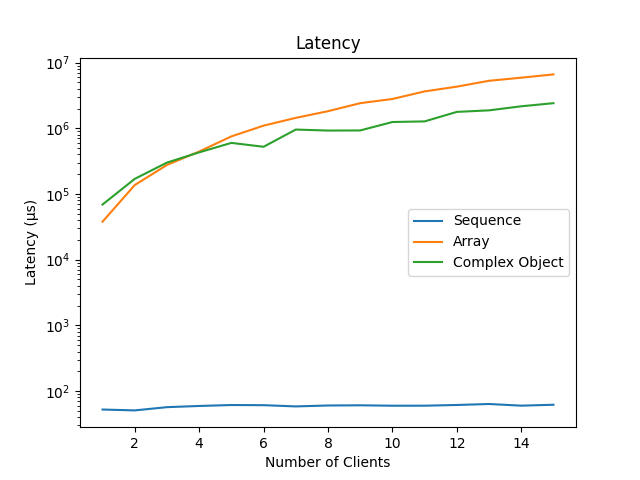
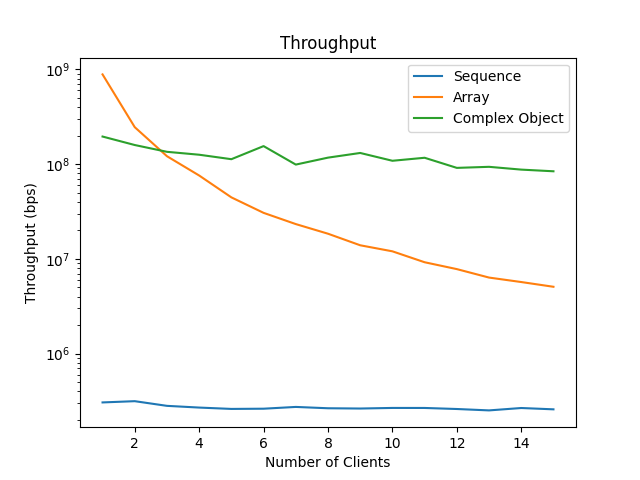
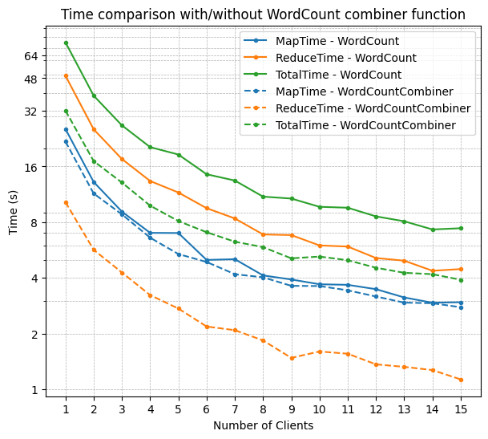
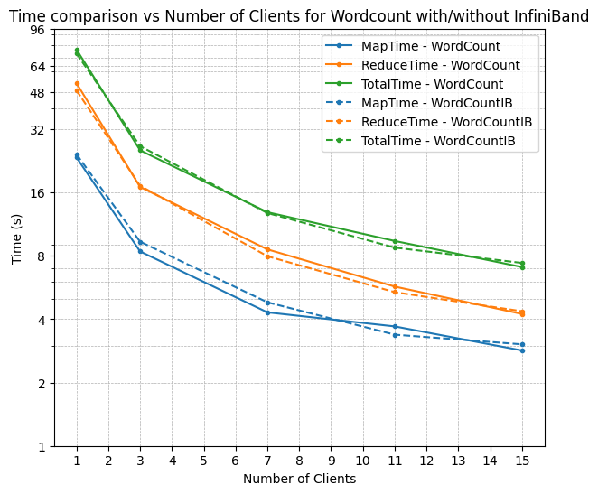
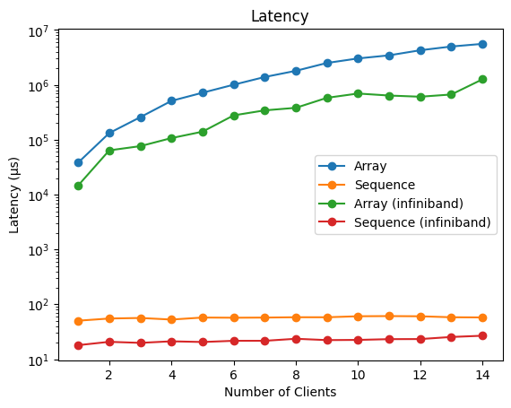
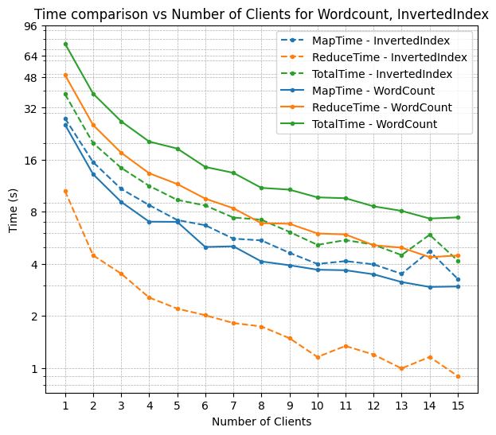
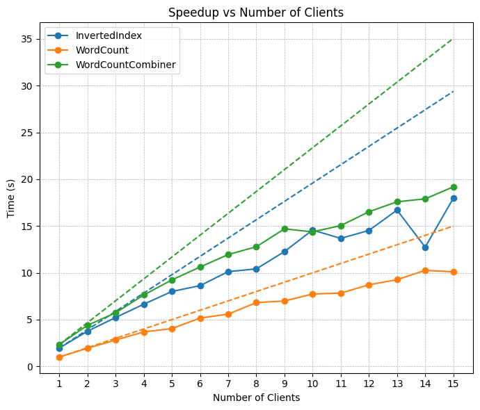

# Distributed Systems 2025 — Team MinMax

**Student 1:** Michail Athanasios Kalligeris Skentzos (Thanos) — 4398831  
**Student 2:** Jyothis Gireesan Mini (Jo) — 3777103

---

## Repository Structure

```
DS2025/
├── 1_rmi_benchmarking/   # Assignment 1: RMI Benchmarking
└── 2_map_reduce/         # Assignment 2: Fault-Tolerant MapReduce
```

---

## Assignment 1 — RMI Benchmarking (`1_rmi_benchmarking`)

### Overview

A benchmarking framework built on Java RMI to measure latency and throughput for three types of data transfer — sequential integers, large arrays, and complex objects (HashMaps) — across 1 to 15 concurrent clients.

### Who Did What

- **Thanos:** Initial RMI implementation, sequence number version, result plotting.
- **Jo:** Improved sequence number logic, array and HashMap transfer implementations.
- Both collaborated on debugging.

### Design & Implementation

**RMI Setup:** The `ServerInterface` extends `Remote` and all methods throw `RemoteException`. The server creates a `ServerImplementation`, exports it as a `UnicastRemoteObject`, and binds the stub to a registry. Clients retry connection until successful before starting experiments.

**Barrier Synchronization:** An atomic variable tracks how many clients have entered the barrier. Modulo arithmetic allows the barrier to be reused across multiple experiment phases (sequential, array, object), enabling clean synchronization without restart.

**Experiments:** Each client tracks elapsed time per phase and reports it to the server. Synchronized server functions (`getSequenceNumber`, `setDone`) handle race conditions. Results are printed in CSV format, aggregated via `gather.sh`, and plotted with `plot.py` (requires `numpy`, `pandas`, `matplotlib`).

### Results

#### Latency


#### Throughput


### Observations

1. **Latency scales almost exponentially** with more clients due to thread contention on synchronized functions and serialization overhead for larger objects.
2. **Throughput is higher for arrays and HashMaps** than for sequential integers — larger data per RPC call outweighs the per-call overhead, though throughput drops sharply as concurrency increases.
3. **Arrays outperform HashMaps** at low concurrency due to contiguous memory and efficient Java serialization, but this advantage degrades at higher concurrency as the single large transfer becomes a bottleneck.

### Running the Experiments

```bash
cd 1_rmi_benchmarking
./run-all.sh          # Runs experiments for 1–15 clients
./gather.sh           # Aggregates results into results.csv
python3 plot.py       # Generates latency and throughput plots
```

---

## Assignment 2 — Fault-Tolerant MapReduce (`2_map_reduce`)

### Overview

A distributed MapReduce framework built on Java RMI supporting two applications — **WordCount** and **InvertedIndex** — with fault tolerance via heartbeat monitoring, job re-queuing, and coordinator election.

### Who Did What

- **Jo:** RMI implementation, distributed map phase with queues, coordinator heartbeats, node failure logic.
- **Thanos:** Logging, combiner logic with HashMaps, reduce phase, InfiniBand integration.
- Both collaborated on result plotting.

### Design & Implementation

**Coordinator:** Creates an RMI registry and registers itself by hostname. Splits input filenames into batches sized according to the number of workers, placing them in a queue. Workers pull map jobs and reduce jobs via RPC. Post-processing is handled solely by the coordinator.

**Fault Tolerance:** Each worker creates its own RMI registry so the coordinator can run periodic heartbeat checks. Workers use a retry loop to handle the case where they start before the coordinator. The coordinator tracks in-flight jobs as `(index, filenames)` tuples in a "taken jobs" list. On job completion, the worker notifies the coordinator to remove the entry. If a worker fails a heartbeat check, its job is re-queued automatically.

**Consistency:** Phase transitions are gated on three conditions: the job queue is empty, the taken-jobs list is empty, and the coordinator has prepared the next phase's file list. This prevents workers from reading intermediate files before all map jobs have completed correctly. Intermediate filenames encode both the job number and a flush index to prevent overwriting between concurrent workers.

### Additional Features

**WordCount Combiner:** Instead of emitting `(word, "1")` for every occurrence, a HashMap accumulates counts locally before flushing, reducing intermediate files by a factor of ~4 (from 322 to 66). This translates to roughly 4× improvement in reduce-phase time with negligible map-phase overhead.



**InfiniBand Support:** Workers can communicate over InfiniBand by binding registry stubs to InfiniBand IPs via a modified `getIP()` in `Utils`. File I/O still uses Ethernet-mounted NFS. The speedup for MapReduce workloads was negligible since compute and file I/O dominate, but InfiniBand reproduced the ~4× latency improvement observed in Assignment 1.

  


### Results

#### Time Scaling (log scale)


All phase times scale down with more workers. InvertedIndex has shorter reduce time relative to map time; WordCount is the opposite — both expected given application characteristics.

#### Speedup vs Linear


All configurations scale near-linearly but below theoretical linear speedup. The gap is attributed to worker idle time while waiting for a phase to be declared complete — a deliberate fault-tolerance tradeoff.

### Running the Experiments

```bash
cd 2_map_reduce
./run-all.sh          # Runs WordCount and InvertedIndex for varying worker counts
```

---

## Acknowledgements

No external collaboration or outside help beyond course materials.

---

## Final Grade

| Component        | Grade | Weight (%) | Weighted Score |
|------------------|-------|------------|----------------|
| Assignment 1     | 10.0  | 24         | 2.400          |
| Assignment 2     | 9.83  | 36         | 3.528          |
| Presentation     | 9.0   | 10         | 0.900          |
| Final Exam       | 8.5   | 30         | 2.550          |
| **Total**        |       | **100**    | **9.378**      |

**Final Calculated Grade: 9.378 → Rounded: 9.5 **
